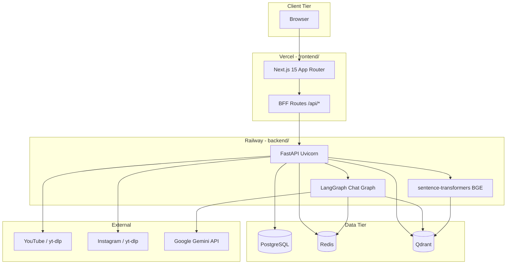
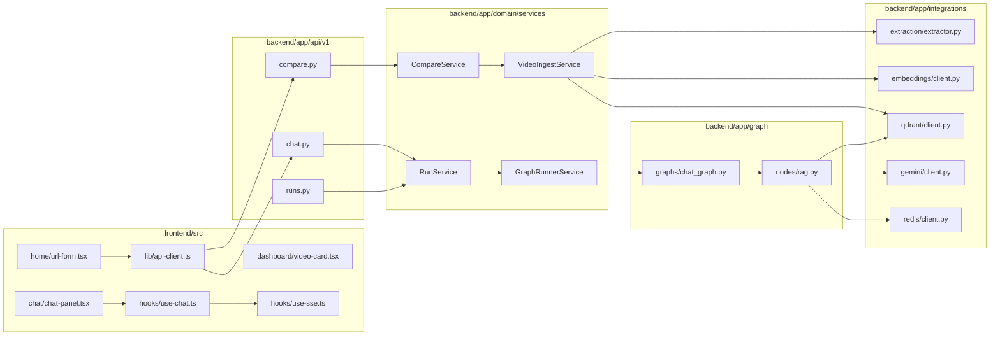
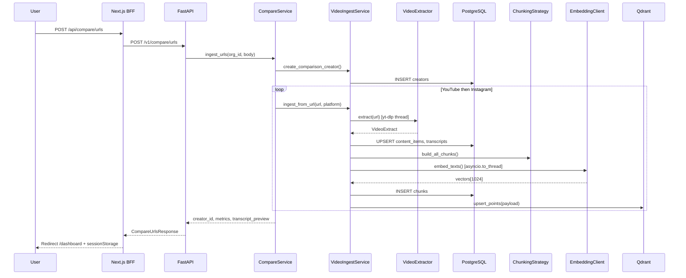
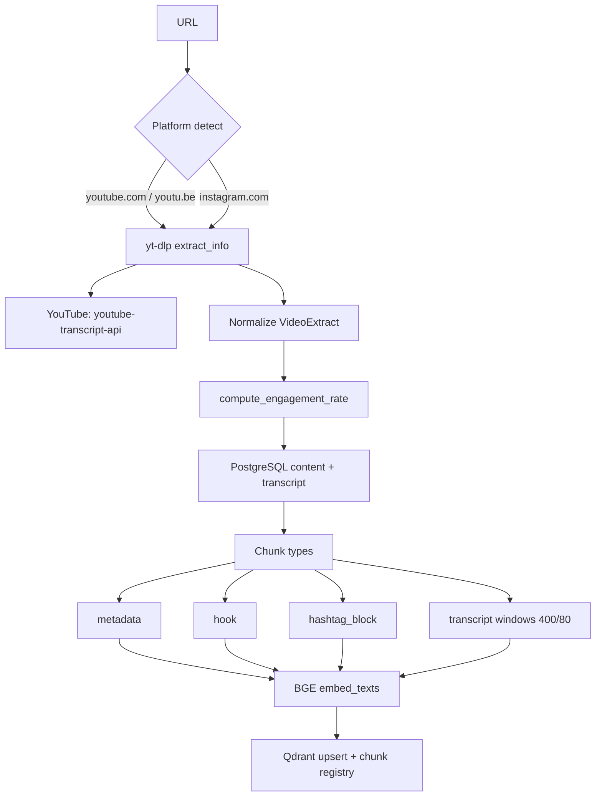
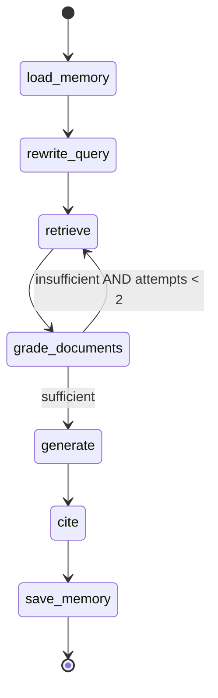
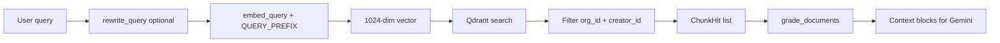
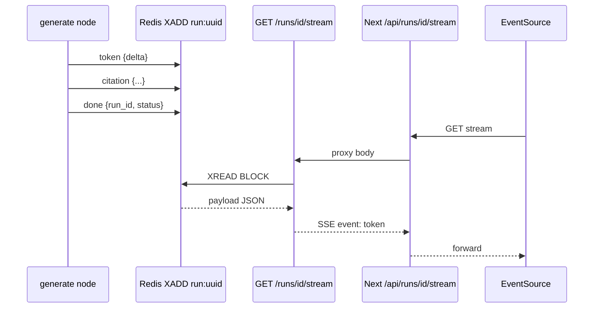
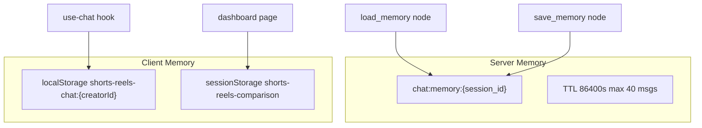
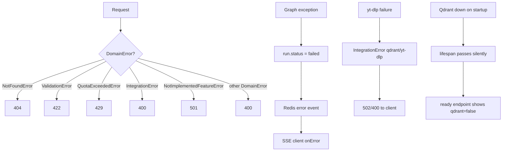
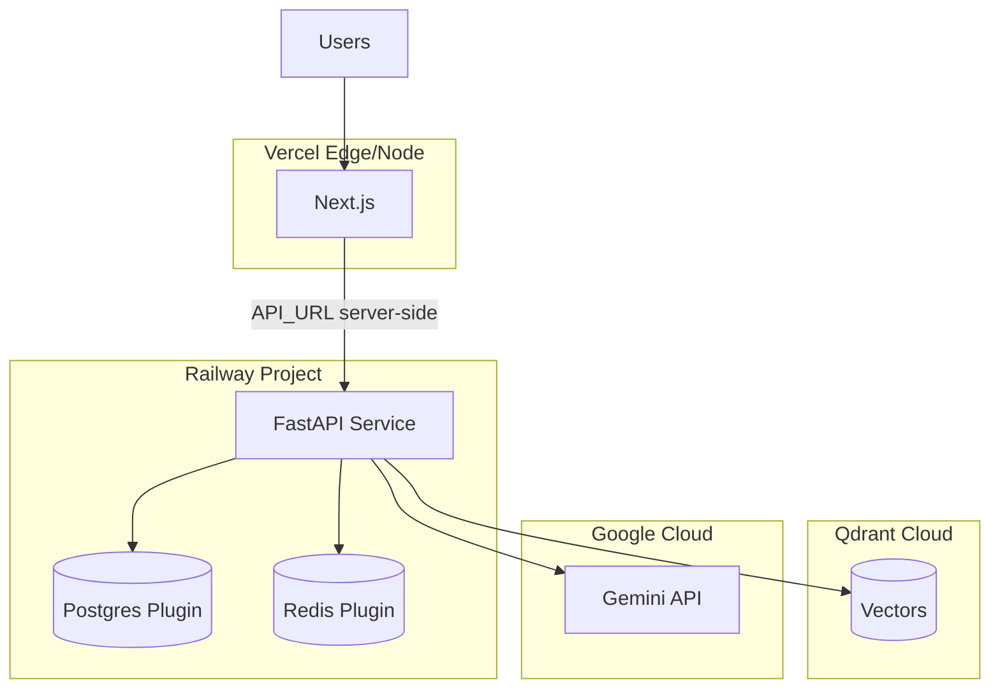

# Architecture

This document describes the **as-built** architecture of the Shorts × Reels RAG platform. All diagrams reflect code under `backend/` and `frontend/`.

---

## 1. High-Level Architecture

**Boundary rules:**

- **PostgreSQL** — system of record: creators, content, transcripts, chunks, analysis runs, citations, jobs.
- **Qdrant** — semantic index only; every search filters `org_id` + `creator_id` (`QdrantClientWrapper._build_filter`).
- **Redis** — ephemeral: SSE fan-out (`run:{run_id}` streams) and chat memory (`chat:memory:{session_id}`).
- **LangGraph** — chat orchestration in-process; compare graph exists but is **not** used for `/compare/urls` today.

---

## 2. Component Diagram

---

## 3. Data Flow — URL Ingest (`POST /v1/compare/urls`)

**Deduping:** `content_hash = sha256(platform:id:transcript)` skips re-index when unchanged (`VideoIngestService.ingest_from_url`).

---

## 4. Ingestion Pipeline

**Extraction implementation:** `backend/app/integrations/extraction/extractor.py`  
**Chunking:** `backend/app/rag/chunking/strategy.py` — `TRANSCRIPT_MAX_TOKENS=400`, `TRANSCRIPT_OVERLAP_TOKENS=80`

---

## 5. Chat Pipeline (LangGraph)

**Compiled graph:** `build_chat_graph()` in `backend/app/graph/graphs/chat_graph.py`

**Routing:** `documents_relevant()` in `app/graph/edges.py` — sufficient if `len(graded_chunks) >= grade_min_chunks` (default 2) OR `retrieval_attempts >= 2`.

| Node | File | Behavior |
|------|------|----------|
| `load_memory` | `nodes/rag.py` | Redis → LangChain messages |
| `rewrite_query` | `nodes/rag.py` | Gemini standalone query from last 6 turns |
| `retrieve` | `nodes/rag.py` | BGE query embed + Qdrant top-K (8 or 16 on retry) |
| `grade_documents` | `nodes/rag.py` | Score ≥ 0.35 + optional Gemini YES/NO |
| `generate` | `nodes/rag.py` | Gemini stream → Redis `token` events |
| `cite` | `nodes/rag.py` | Build citations → Redis `citation` events |
| `save_memory` | `nodes/rag.py` | Append user/assistant to Redis memory |

**Execution:** `RunService.send_chat_message` → `asyncio.create_task(GraphRunnerService.run_chat)`.

---

## 6. Retrieval Pipeline

**Retrieval service:** `backend/app/rag/retrieval/service.py`  
**Settings:** `RETRIEVAL_TOP_K=8`, `RETRIEVAL_SCORE_THRESHOLD=0.35`

---

## 7. Streaming Pipeline

**Stream key:** `{REDIS_STREAM_PREFIX}:{run_id}` (default `run:{uuid}`)  
**Payload shape:** `{"event":"token","delta":"..."}` serialized in field `payload`  
**Client:** `frontend/src/hooks/use-sse.ts` listens for `status|token|citation|done|error`

---

## 8. Memory Flow

**Session ID:** `AnalysisRun.id` from `POST /chat/sessions` (type `CHAT`, status `COMPLETED`).  
**Message runs:** Each user message creates a new `AnalysisRun` with `run_type=CHAT`, status `QUEUED` → background graph.

---

## 9. Error Handling Flow

**Handler:** `app/api/exception_handlers.py` maps `DomainError` subclasses to HTTP status.

---

## 10. Deployment Architecture

**Note:** BGE runs **in the API process** today (`EmbeddingClient` + `asyncio.to_thread`). For production scale, split to a dedicated embedding worker with GPU.

---

## Database Schema (PostgreSQL)

| Table | Role |
|-------|------|
| `organizations` | Tenant |
| `users` | Org members |
| `creators` | Comparison session / channel grouping |
| `content_items` | One Short or Reel per row |
| `transcripts` | Full text + segments JSON |
| `chunks` | Chunk registry + `qdrant_point_id` |
| `analysis_runs` | Compare + chat runs |
| `citations` | Persisted citation rows per run |
| `jobs` | Async job registry (Celery stub) |
| `usage_daily` | Quota counters (read stub) |

Migration: `backend/alembic/versions/20250601_0001_initial_schema.py`

---

## Qdrant Design (As Implemented)

| Property | Value |
|----------|-------|
| Collection | `content_chunks_bge_large_v1_5` |
| Dimensions | 1024 |
| Distance | Cosine |
| Payload indexes | `org_id`, `creator_id`, `platform`, `content_item_id`, `chunk_type` |
| Schema | `ChunkMetadataPayload` v1.0 (`app/rag/metadata/schema.py`) |

---

## Compare Graph (Scaffold)

`backend/app/graph/graphs/compare_graph.py` defines a multi-step compare workflow (`plan_compare_queries`, `parallel_retrieve`, `synthesize_compare`, etc.), but **nodes in `nodes/compare.py` are phase stubs** and **`CompareService.start_compare` invokes `build_chat_graph()`** instead.

Document this accurately in reviews: the **production RAG path is the chat graph**.

---

## Related Documents

- [SYSTEM_DESIGN.md](./SYSTEM_DESIGN.md) — capacity and NFRs  
- [SCALABILITY.md](./SCALABILITY.md) — growth paths  
- [TRADEOFFS.md](./TRADEOFFS.md) — decision log  
