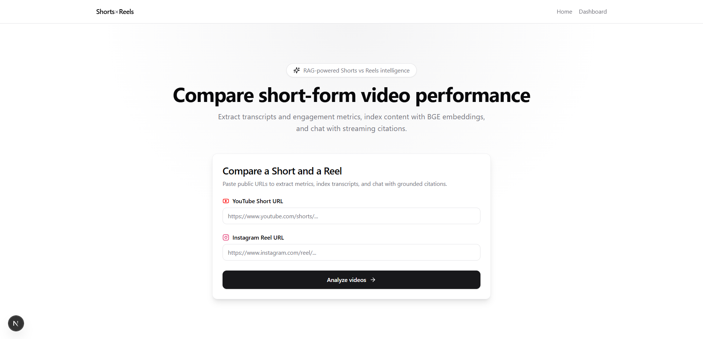
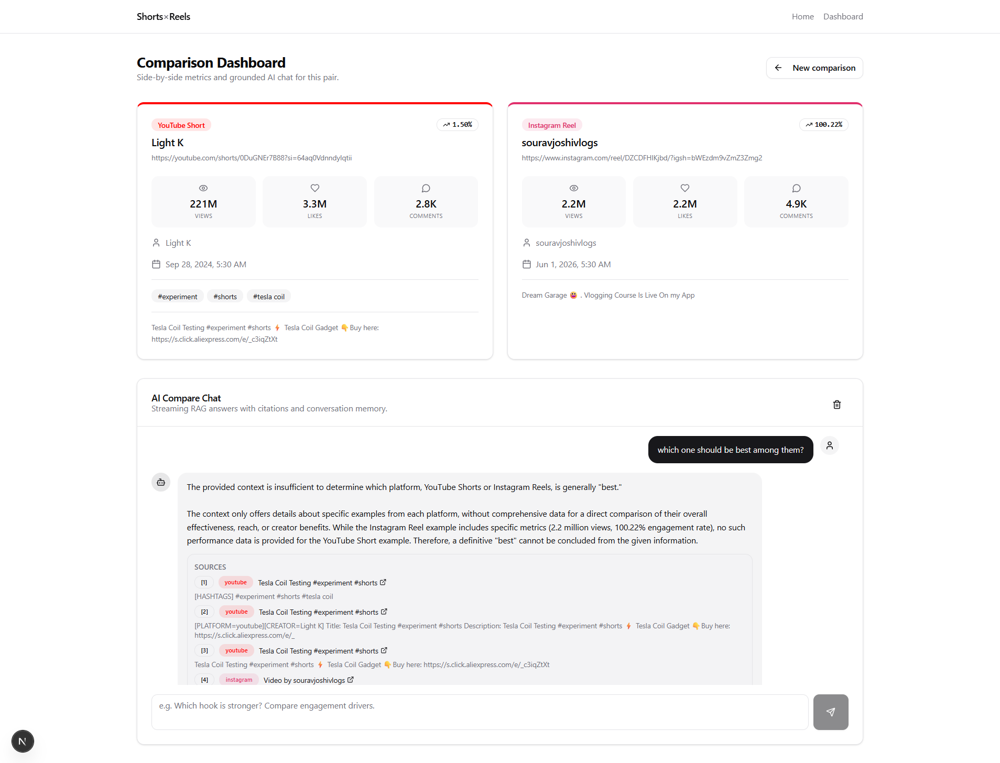
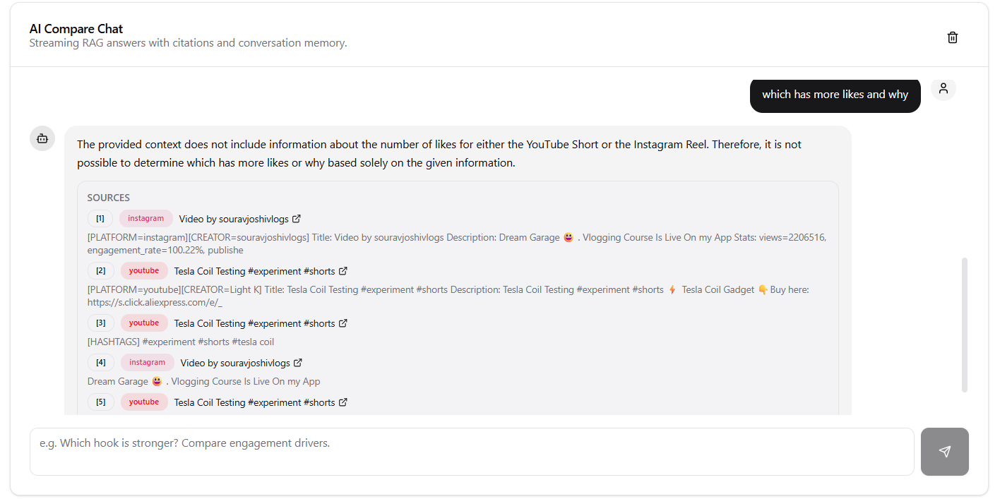

# Shorts × Reels Intelligence Platform

**Production-oriented RAG system for comparing YouTube Shorts and Instagram Reels with grounded, streaming AI chat.**

[](frontend/)
[](backend/)
[](backend/app/graph/)
[](backend/app/integrations/qdrant/)

---

## Overview

Creators publish the same ideas on **YouTube Shorts** and **Instagram Reels**, but performance diverges: hooks, pacing, hashtags, and audience response differ by platform. Manual comparison does not scale.

This platform:

1. Accepts a **YouTube Short URL** and an **Instagram Reel URL**
2. **Extracts** transcripts, creator metadata, engagement metrics, and hashtags
3. **Chunks and embeds** content with BGE (`BAAI/bge-large-en-v1.5`)
4. **Indexes** vectors in **Qdrant** with tenant-scoped payload filters
5. Runs a **LangGraph** workflow: retrieve → grade → generate → cite
6. Returns **streaming answers** with **source citations** and **conversation memory**

The implementation is split into a **Next.js 15** frontend (Vercel-ready) and a **FastAPI** backend (Railway-ready), with **PostgreSQL** as the system of record, **Redis** for streams and chat memory, and **Gemini 2.5 Flash** for generation and grading.

---

## Features (Implemented)

| Category | Feature |
|----------|---------|
| **Ingestion** | YouTube Short URL ingestion via `yt-dlp` + `youtube-transcript-api` |
| **Ingestion** | Instagram Reel URL ingestion via `yt-dlp` |
| **Extraction** | Transcript, creator name, title, description, views, likes, comments, upload date, hashtags |
| **Metrics** | Engagement rate: `(likes + comments) / views × 100` (`app/domain/engagement.py`) |
| **Chunking** | Metadata, hook, hashtag, and transcript chunks (400-token windows, 80-token overlap) |
| **Embeddings** | In-process BGE-large with query/document instruction prefixes |
| **Vector DB** | Qdrant collection `content_chunks_bge_large_v1_5`, cosine, 1024-dim, payload indexes |
| **RAG** | Dense retrieval with mandatory `org_id` + `creator_id` filters |
| **LangGraph** | Chat graph: `load_memory` → `rewrite_query` → `retrieve` → `grade` → `generate` → `cite` → `save_memory` |
| **LLM** | Gemini 2.5 Flash via `langchain-google-genai` |
| **Streaming** | Redis Streams → SSE (`/v1/runs/{id}/stream`) → Next.js BFF proxy |
| **Citations** | Live `citation` SSE events + PostgreSQL `citations` table persistence |
| **Memory** | Redis `chat:memory:{session_id}` (server) + `localStorage` (client UI continuity) |
| **UI** | Homepage URL form, dashboard with side-by-side video cards, streaming chat panel |
| **API** | Full REST surface under `/v1` (creators, content, compare, chat, runs, jobs, health) |
| **Auth (dev)** | `DEV_AUTH_BYPASS` with auto-provisioned default organization |

**Scaffolded (not production-complete):** dedicated `compare_graph` nodes, Celery workers, JWT auth, `UsageService`, LangGraph Redis checkpointer.

---

## Architecture Overview

```text
User (Browser)
    │
    ▼
Next.js 15 (frontend/) ── BFF /api/* ──► FastAPI (backend/)
    │                                        │
    │                                        ├── PostgreSQL (metadata, chunks, runs)
    │                                        ├── Redis (SSE streams, chat memory)
    │                                        ├── Qdrant (vectors)
    │                                        └── Gemini 2.5 Flash (generate/grade)
    │
    └── sessionStorage + localStorage (comparison + chat UI state)
```

See [ARCHITECTURE.md](./ARCHITECTURE.md) for diagrams and request lifecycles.

---

## Tech Stack

| Layer | Technology |
|-------|------------|
| **Frontend** | Next.js 15, React 19, TypeScript, Tailwind CSS, shadcn/ui (Radix) |
| **Backend** | FastAPI, Uvicorn, Pydantic v2, SQLAlchemy 2 async, Alembic |
| **Orchestration** | LangGraph (`app/graph/graphs/chat_graph.py`) |
| **LLM** | Google Gemini 2.5 Flash (`GEMINI_MODEL`) |
| **Embeddings** | `sentence-transformers` → `BAAI/bge-large-en-v1.5` (1024 dims) |
| **Vector DB** | Qdrant (`content_chunks_bge_large_v1_5`) |
| **Cache / streams** | Redis (Streams + string keys for memory) |
| **Database** | PostgreSQL 15+ |
| **Extraction** | `yt-dlp`, `youtube-transcript-api` |
| **Deployment (target)** | Vercel (frontend) + Railway (backend, Postgres, Redis, Qdrant) |

---

## System Workflow

```text
User enters YouTube + Instagram URLs (/)
        │
        ▼
POST /v1/compare/urls  (CompareService.ingest_urls)
        │
        ├── VideoExtractor (yt-dlp + transcript APIs)
        ├── Persist Creator, ContentItem, Transcript, Chunk rows (PostgreSQL)
        ├── ChunkingStrategy.build_all_chunks()
        ├── EmbeddingClient.embed_texts()  [BGE, batched]
        └── QdrantClientWrapper.upsert_points()
        │
        ▼
Dashboard (/dashboard) — engagement cards
        │
        ▼
POST /v1/chat/sessions/{id}/messages
        │
        ├── asyncio.create_task → GraphRunnerService.run_chat()
        └── LangGraph chat graph (retrieve → grade → generate → cite)
        │
        ▼
GET /v1/runs/{run_id}/stream (SSE: token, citation, done)
        │
        ▼
Streaming UI (EventSource via /api/runs/{id}/stream)
```

---

## Repository Structure

```text
Software Engineer Screening task/
├── README.md                 # This file
├── ARCHITECTURE.md
├── SYSTEM_DESIGN.md
├── SCALABILITY.md
├── TRADEOFFS.md
├── DEPLOYMENT.md
├── INTERVIEW_GUIDE.md
├── COMMIT_HISTORY.md
├── .env.example
├── backend/                  # FastAPI application
│   ├── app/
│   │   ├── api/v1/           # HTTP routes
│   │   ├── config/           # Settings, logging
│   │   ├── db/models/        # SQLAlchemy ORM
│   │   ├── domain/services/  # Business logic
│   │   ├── graph/            # LangGraph state, nodes, graphs
│   │   ├── integrations/     # Qdrant, Redis, Gemini, extraction
│   │   ├── rag/              # Chunking, metadata, retrieval
│   │   └── workers/          # Celery (stub tasks)
│   ├── alembic/versions/
│   └── pyproject.toml
└── frontend/                 # Next.js application
    └── src/
        ├── app/              # Pages + BFF API routes
        ├── components/       # UI, home, dashboard, chat
        ├── hooks/            # use-sse, use-chat
        └── lib/              # api-client, types, storage
```

---

## API Endpoints

Base URL: `http://localhost:8000/v1` (backend) or `http://localhost:3000/api` (BFF).

| Method | Path | Description |
|--------|------|-------------|
| `GET` | `/health` | Liveness |
| `GET` | `/ready` | Postgres + Redis + Qdrant readiness |
| `POST` | `/compare/urls` | **Primary flow** — ingest two URLs, index, return metrics |
| `POST` | `/compare` | Start compare run (uses chat graph synchronously) |
| `GET` | `/compare/{run_id}` | Compare / analysis result |
| `POST` | `/creators` | Create creator |
| `GET` | `/creators` | List creators |
| `GET` | `/creators/{id}` | Get creator |
| `PATCH` | `/creators/{id}` | Update creator |
| `DELETE` | `/creators/{id}` | Delete creator |
| `POST` | `/creators/{id}/sync` | Enqueue sync job (job record only; worker stub) |
| `GET` | `/creators/{id}/content` | List content items |
| `GET` | `/content/{id}` | Get content item |
| `POST` | `/ingest/webhook` | Webhook placeholder |
| `POST` | `/chat/sessions` | Create chat session (`AnalysisRun` row) |
| `POST` | `/chat/sessions/{id}/messages` | Send message → background graph run |
| `GET` | `/runs/{id}` | Run status + `result_summary` |
| `GET` | `/runs/{id}/stream` | **SSE** stream (Redis-backed) |
| `GET` | `/jobs/{id}` | Job status |
| `GET` | `/usage` | Daily usage (service stub → 501) |

**Frontend BFF routes:** `POST /api/compare/urls`, `POST /api/chat/sessions`, `POST /api/chat/sessions/[id]/messages`, `GET /api/runs/[id]/stream`.

---

## Running Locally

### Prerequisites

- Python 3.11+
- Node.js 20+
- Docker (recommended) for Postgres, Redis, Qdrant

### 1. Infrastructure

```bash
docker run -d --name pg -e POSTGRES_PASSWORD=postgres -p 5432:5432 postgres:16
docker run -d --name redis -p 6379:6379 redis:7
docker run -d --name qdrant -p 6333:6333 qdrant/qdrant
```

Create database: `createdb shorts_reels_rag` (or via psql).

### 2. Backend

```bash
cd backend
python -m venv .venv
# Windows: .venv\Scripts\activate
source .venv/bin/activate
pip install -e ".[dev]"
cp ../.env.example .env
# Set GOOGLE_API_KEY in .env
alembic upgrade head
uvicorn app.main:app --reload --host 0.0.0.0 --port 8000
```

First ingest downloads the BGE model (~1.3GB) — allow several minutes.

### 3. Frontend

```bash
cd frontend
npm install
cp ../.env.example .env.local
# Ensure API_URL=http://localhost:8000
npm run dev
```

Open [http://localhost:3000](http://localhost:3000).

### 4. Smoke test

```bash
cd backend && pytest tests/unit -q
cd frontend && npm run build
```

---

## Environment Variables

See [`.env.example`](./.env.example) for the full list with comments.

**Critical for chat:**

| Variable | Purpose |
|----------|---------|
| `GOOGLE_API_KEY` | Gemini generate, grade, query rewrite |
| `DATABASE_URL` | PostgreSQL async connection |
| `REDIS_URL` | Streams + chat memory |
| `QDRANT_URL` | Vector search |
| `DEV_AUTH_BYPASS` | `true` for local dev (auto org/user) |

**Frontend:**

| Variable | Purpose |
|----------|---------|
| `API_URL` | FastAPI base (BFF server-side only) |

---

## Deployment

| Component | Target | Notes |
|-----------|--------|-------|
| Frontend | **Vercel** | Set `API_URL` to Railway backend URL |
| API + workers | **Railway** | Uvicorn service; separate GPU service optional for BGE |
| PostgreSQL | **Railway** / RDS | Run `alembic upgrade head` |
| Redis | **Railway** / Upstash | Same region as API |
| Qdrant | **Qdrant Cloud** or Railway | Set `QDRANT_API_KEY` |

Full guide: [DEPLOYMENT.md](./DEPLOYMENT.md).

---

## Example Questions (Chat)

After ingesting URLs on the dashboard:

- *"Why did the YouTube Short likely outperform the Reel on engagement rate?"*
- *"Compare the opening hooks in the first 10 seconds."*
- *"Which hashtags overlap, and which are platform-specific?"*
- *"What content improvements would you suggest for the lower-performing video?"*
- *"Summarize transcript themes side by side with citations."*

---

## Screenshots

| Screen | Description |
|--------|-------------|
|  | URL input for YouTube Short + Instagram Reel |
|  | Side-by-side metrics cards |
|  | Streaming response with citations |

> Add screenshots to `docs/screenshots/` before submission.

---

## Documentation Index

| Document | Audience |
|----------|----------|
| [ARCHITECTURE.md](./ARCHITECTURE.md) | Engineers — diagrams, data flows |
| [SYSTEM_DESIGN.md](./SYSTEM_DESIGN.md) | Staff+ — NFRs, capacity, failure modes |
| [SCALABILITY.md](./SCALABILITY.md) | Growth — 100 → 100k users |
| [TRADEOFFS.md](./TRADEOFFS.md) | Design decisions |
| [DEPLOYMENT.md](./DEPLOYMENT.md) | DevOps / production rollout |
| [INTERVIEW_GUIDE.md](./INTERVIEW_GUIDE.md) | Screening prep |
| [COMMIT_HISTORY.md](./COMMIT_HISTORY.md) | Suggested git narrative |

---

## Future Improvements

1. **Wire `compare_graph`** — Replace chat-graph reuse in `CompareService.start_compare` with dedicated multi-query compare pipeline.
2. **Background ingest** — Move `ingest_urls` to Celery; return `202` + job ID immediately.
3. **JWT auth** — Implement `get_auth` production path; remove `DEV_AUTH_BYPASS`.
4. **Embedding service** — Split BGE to GPU microservice; keep API CPU-light.
5. **Hybrid retrieval** — BM25 on hashtags + dense vectors; RRF merge.
6. **Instagram resilience** — Official Graph API adapter + cookie rotation for yt-dlp failures.
7. **Usage metering** — Implement `UsageService` + plan quotas.
8. **LangGraph checkpointer** — Enable Redis checkpointing for durable graph replay.
9. **Evaluation harness** — Golden Q&A set for retrieval and citation precision.
10. **INT8 Qdrant quantization** — Reduce RAM at >5M vectors.

---

## License

Private — technical screening submission.
