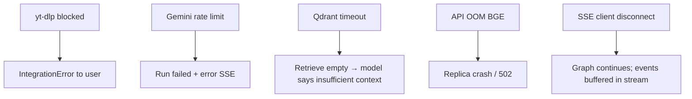
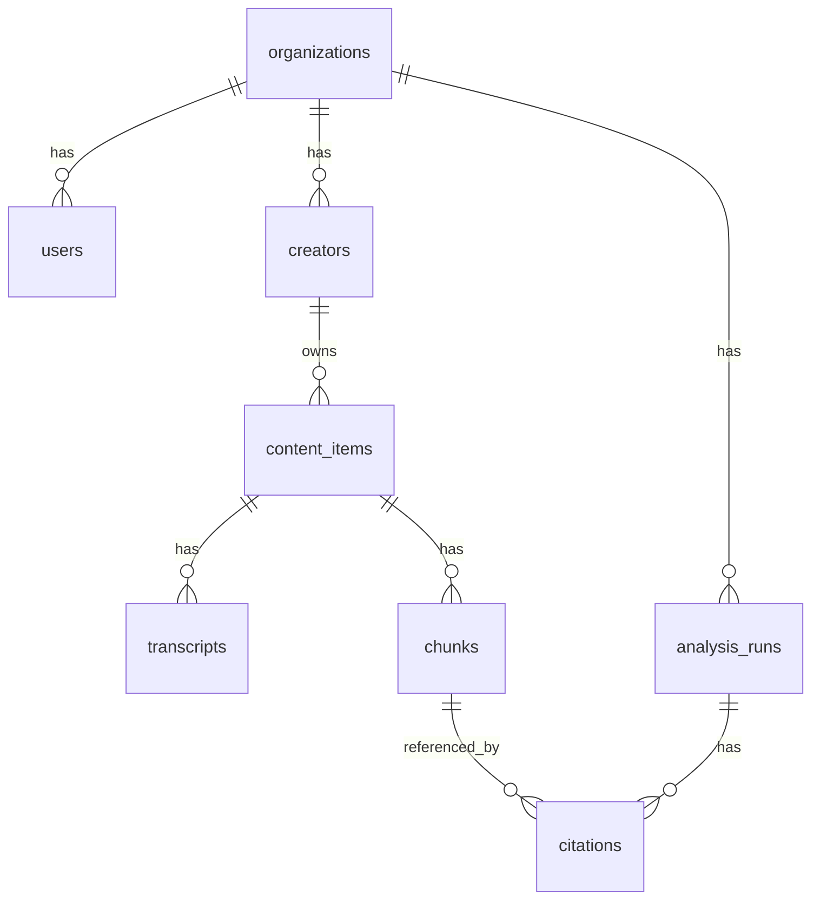

# System Design

Full system design document for the **Shorts × Reels RAG Platform** as implemented in this repository.

---

## 1. Problem Statement

Creators cross-post short video to YouTube and Instagram. Platform-specific performance differs, but manual comparison of transcripts, hooks, hashtags, and engagement does not scale.

**Solution:** URL-driven ingest, vector-indexed RAG, and streaming grounded Q&A with citations.

---

## 2. Functional Requirements

| ID | Requirement | Status |
|----|-------------|--------|
| FR-1 | Accept YouTube Short URL | Done — `POST /v1/compare/urls` |
| FR-2 | Accept Instagram Reel URL | Done — same endpoint |
| FR-3 | Extract transcript | Done — `youtube-transcript-api` + yt-dlp fallback text |
| FR-4 | Extract creator, views, likes, comments, date, hashtags | Done — `VideoExtract` |
| FR-5 | Compute engagement rate | Done — `compute_engagement_rate` |
| FR-6 | Chunk and embed content | Done — `ChunkingStrategy` + `EmbeddingClient` |
| FR-7 | Store vectors in Qdrant | Done — `upsert_points` |
| FR-8 | RAG Q&A with retrieval + generation | Done — chat LangGraph |
| FR-9 | Stream tokens to client | Done — Redis SSE |
| FR-10 | Show citations | Done — SSE + DB + UI |
| FR-11 | Conversation memory | Done — Redis + client localStorage |
| FR-12 | Multi-tenant org isolation | Partial — schema + Qdrant filters; dev auth bypass |
| FR-13 | Async bulk creator sync | Scaffold — Celery tasks stub |
| FR-14 | Structured compare report graph | Scaffold — `compare_graph` nodes stub |

---

## 3. Non-Functional Requirements

| NFR | Target | Current state |
|-----|--------|---------------|
| **Availability** | 99.5% API | Single-instance MVP |
| **Ingest latency** | <60s p95 per pair | Often 30–120s; sync in request |
| **Chat TTFT** | <2s to first token | Depends on Gemini + retrieval |
| **Retrieval p95** | <200ms | Qdrant local — not load tested |
| **Durability** | No data loss on crash | PG committed; Redis streams ephemeral |
| **Security** | Tenant isolation | Qdrant filters; JWT not implemented |
| **Cost** | <$0.10 per comparison | Dominated by Gemini + compute |

---

## 4. Capacity Estimates

### Assumptions (planning)

- Average **10 chunks/video**, 2 videos per comparison  
- Average **5 chat turns** per comparison session  
- **BGE encode:** ~100ms/chunk CPU (varies)  
- **Gemini:** ~1 grade call per retrieved chunk + 1 generate stream  

### Comparisons per day → vectors

| Comparisons/day | New chunks/day | Cumulative (90d) |
|-----------------|----------------|------------------|
| 100 | 2,000 | 180k |
| 1,000 | 20,000 | 1.8M |
| 10,000 | 200,000 | 18M |

Qdrant RAM rough guide: ~1–2 GB per million 1024-dim float vectors (before quantization).

---

## 5. Storage Estimates

| Store | Per comparison | 1k comparisons/day (annual) |
|-------|----------------|------------------------------|
| Postgres rows | ~25 rows | ~9M rows/year |
| Transcript text | 2–10 KB | GB scale — archive to S3 |
| Qdrant vectors | ~20 × 4KB | ~800KB ingest/day |
| Redis stream | ephemeral | Trim with MAXLEN |
| Redis memory | ~10–50 KB/session | TTL 24h |

---

## 6. Request Estimates

| Endpoint | Relative volume |
|----------|-----------------|
| `POST /compare/urls` | Low, heavy |
| `POST /chat/.../messages` | High |
| `GET /runs/.../stream` | High per message |
| `GET /health` | Synthetic monitoring |

**Peak QPS (10k DAU sketch):** 5–20 RPS API; burst on ingest.

---

## 7. Latency Targets

| Stage | Target | Implementation notes |
|-------|--------|----------------------|
| Extract (yt-dlp) | 5–30s | `asyncio.to_thread` |
| Embed batch | 2–15s | `embed_texts` |
| Qdrant upsert | <1s | Batch per video |
| Retrieve | <200ms | `search` top-8 |
| Grade | 0.5–3s | Optional Gemini per chunk |
| Generate stream | 2–20s | Token stream |

**End-to-end chat:** 5–30s typical.

---

## 8. Reliability Goals

| Scenario | Behavior |
|----------|----------|
| Qdrant down at startup | App starts; `/ready` shows `qdrant: false` |
| Redis down | Stream + memory fail; chat breaks |
| Gemini down | Grade falls back to score; generate errors → `failed` run |
| Partial ingest | YouTube may succeed if Instagram fails — today all-or-nothing per request exception |
| Graph exception | `AnalysisRun.status=failed`, Redis `error` event |

**Idempotency:** `content_hash` dedupe; `jobs.idempotency_key` unique constraint (jobs API present).

---

## 9. Availability Targets

| Tier | Target |
|------|--------|
| MVP | Best effort single region |
| Production | 99.5% — multi-AZ Postgres, Redis replica, 2+ API replicas |
| Enterprise | 99.9% — multi-region read, queue-backed ingest |

---

## 10. Failure Scenarios



**Disaster recovery:**

- **Postgres:** PITR backups daily; RTO 1h, RPO 15min (managed provider).
- **Qdrant:** Snapshot collection; rebuild from Postgres `chunks` + re-embed if needed (hours).
- **Redis:** Accept stream loss; chat memory rebuilds from empty (degraded UX).

---

## 11. Monitoring Metrics

| Metric | Type | Alert |
|--------|------|-------|
| `http_requests_total` | Counter | 5xx rate |
| `ingest_duration_seconds` | Histogram | p95 > 120s |
| `embed_batch_duration_seconds` | Histogram | p95 > 30s |
| `qdrant_search_latency_seconds` | Histogram | p95 > 0.2s |
| `gemini_tokens_total` | Counter | cost anomaly |
| `rag_retrieval_chunks` | Histogram | avg < 1 |
| `sse_active_connections` | Gauge | > 1000 |
| `celery_queue_depth` | Gauge | when implemented |

**Implemented today:** structlog logs, `/health`, `/ready`. Metrics stubs in `observability/metrics.py`.

---

## 12. Performance Benchmarks

> Not run in CI — methodology for future benchmarking.

```text
# Suggested commands
pytest backend/tests/unit -q
# Load: locust on POST /compare/urls and chat with mock extractor
```

**Baseline expectations (single 4 vCPU API, local Qdrant):**

| Operation | Expected |
|-----------|----------|
| BGE cold start | 30–120s |
| BGE warm embed 10 texts | 1–5s |
| Qdrant search k=8 | 10–50ms |
| Full URL pair ingest | 30–90s |

---

## 13. API Contract Summary

**Primary:** `CompareUrlsRequest` → `CompareUrlsResponse` with `VideoPlatformSummary` per platform.

**Chat:** `ChatSessionCreate` → `AnalysisRun` id; `ChatMessageCreate` → `run_id` for SSE.

**Stream events:** `status`, `token`, `citation`, `done`, `error`.

---

## 14. Data Model Summary



**Comparison session:** One `Creator` row per URL pair ingest (`display_name` default `"URL Comparison"`).

---

## 15. Security Model (Target)

| Layer | Mechanism |
|-------|-----------|
| Transport | TLS everywhere |
| Auth | JWT → `AuthContext.org_id` |
| Authorization | All queries scoped by `org_id` |
| Secrets | Env / vault |
| Dev bypass | `DEV_AUTH_BYPASS=false` in prod |

---

## 16. Evolution Roadmap

| Phase | Deliverable |
|-------|-------------|
| P0 (now) | URL ingest, chat RAG, SSE, dashboard |
| P1 | Async ingest + Celery |
| P2 | JWT auth + usage quotas |
| P3 | compare_graph production + fact check |
| P4 | Hybrid search + reranker |
| P5 | GPU embedding service + Qdrant quantization |

---

## 17. Related Artifacts

- [ARCHITECTURE.md](./ARCHITECTURE.md) — diagrams  
- [SCALABILITY.md](./SCALABILITY.md) — growth analysis  
- [TRADEOFFS.md](./TRADEOFFS.md) — decisions  
- [DEPLOYMENT.md](./DEPLOYMENT.md) — rollout  
